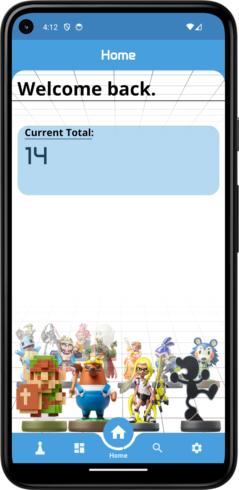
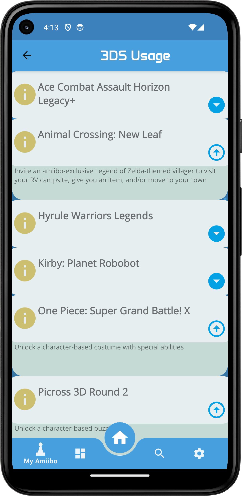
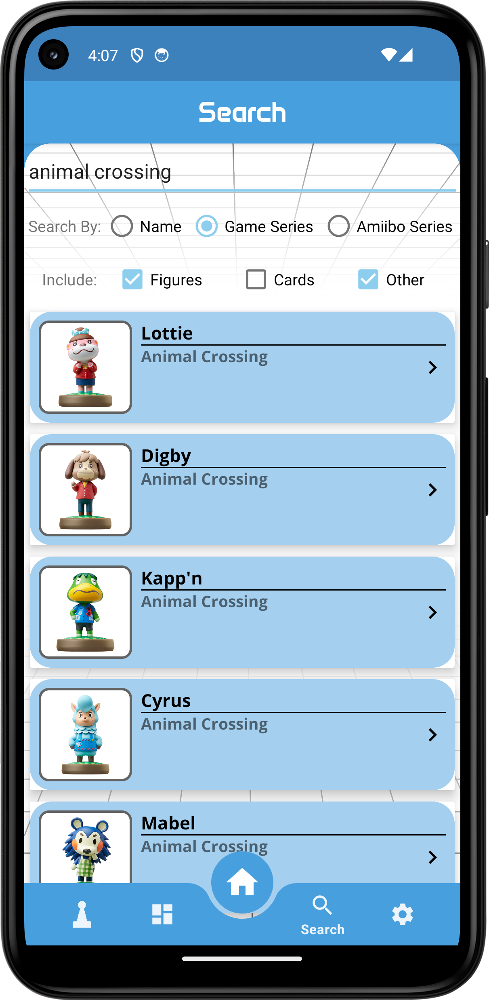
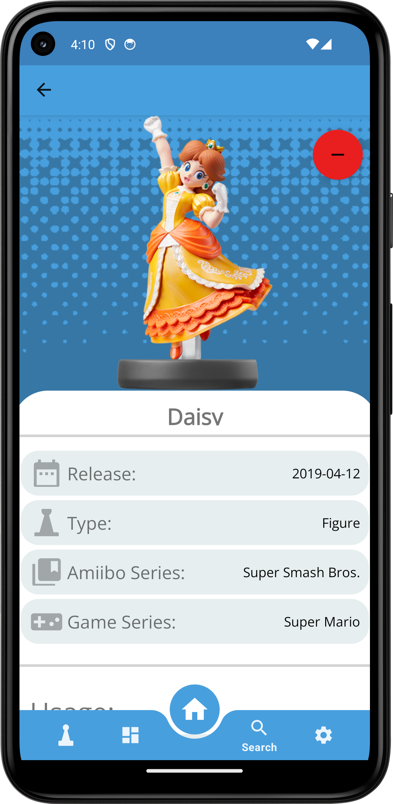
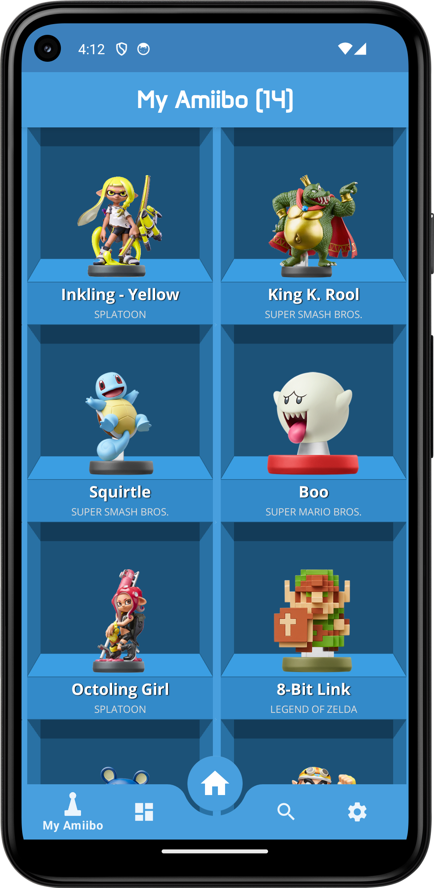

  

## Description

Track, manage, and showcase your amiibo collection with aMADbo, the ultimate companion for amiibo collectors. With aMADbo, you can easily catalog every amiibo figure in your collection, including details such as series, release date, and game usages.

  
  

# Features
## Browse and Search
You can browse through every available series of amiibo, or search for any amiibo by name. Search by Game series, Amiibo Series, or by name and categorize with if you'd like Figures, Cards, or anything other.
Every amiibo has a full detailed view, informing you of everything you need to know about that amiibo, including game usages, so you can know the exact functionality of the amiibo in every game that it is compatible with.

  
  

## View Series
You can view every series of amiibo, such as the Super Smash Bros. series, the Animal Crossing series, and the Legend of Zelda series. 
Each series has a detailed view, informing you of every amiibo in that series, and you can view each amiibo in that series to see more details about that specific amiibo.

  

## Manage your collection
Add and manage any Amiibo by saving them to your personal collection so that you may keep track of what you have. You can view your collection in the My Amiibo tab on the far left bottom item.

  

## View Usages
You can view the usages of any amiibo, such as the games that the amiibo is compatible with, and the functionality of the amiibo in that game.

  

## Adjust Settings
You can adjust the settings of the app to your liking, such as changing the layout of search results,
or disabling animations to make the app run smoother on older devices.

  

## Getting Started

### Dependencies
- Android Studio

### Installation Steps
1. Clone the repository
2. Open the project in Android Studio
3. Build the project
4. Run the project
5. Enjoy!
